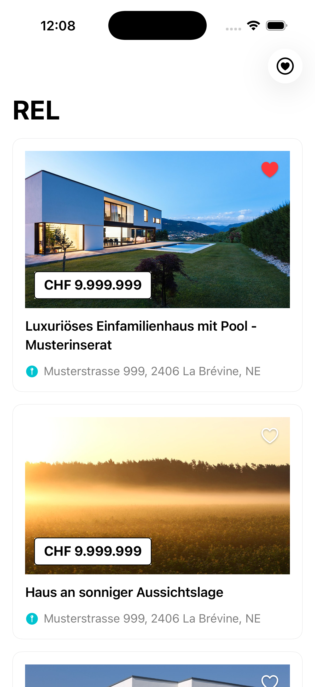
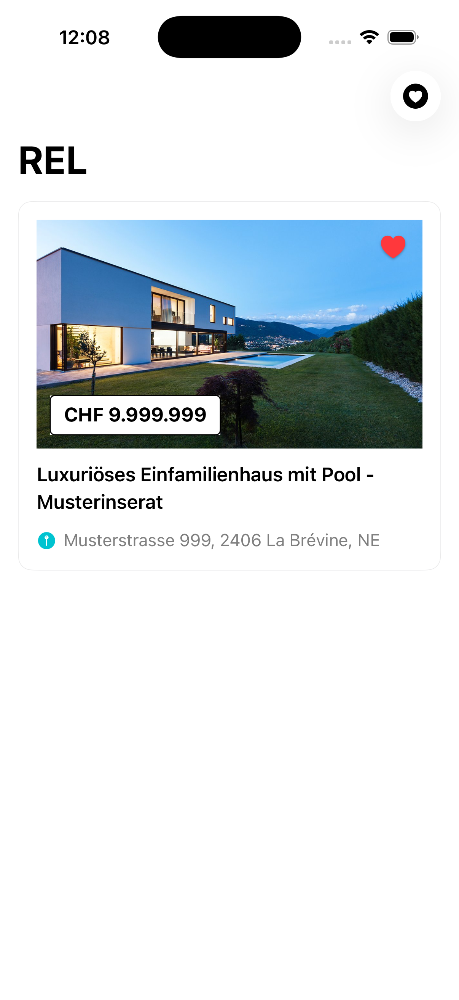
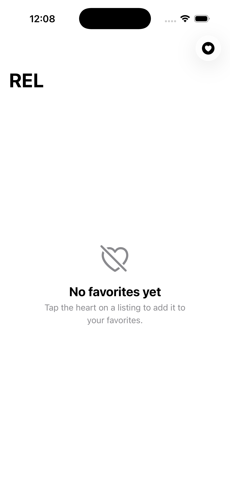
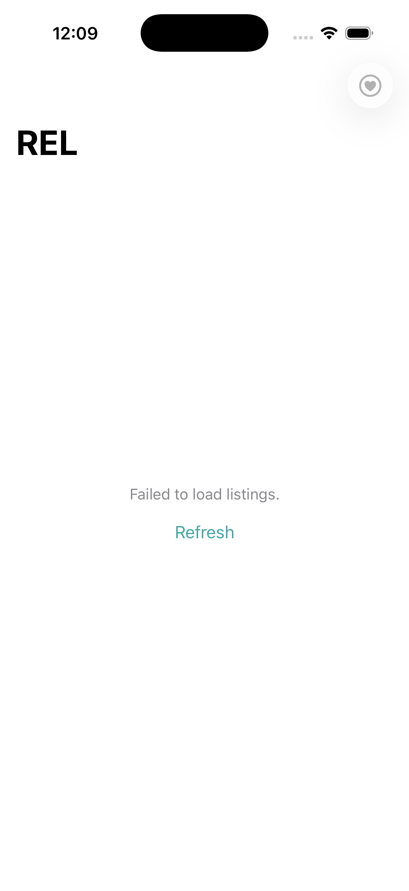

# Real Estate Listings Application

## Table of Contents

- [Screenshots](#screenshots)
- [Description](#description)
- [Technologies Used](#technologies-used)
- [Getting Started](#getting-started)
- [Dependency Injection](#dependency-injection)
- [License](#license)

## Screenshots

### Home Screen


### Favorites Filter Enabled


### No Favorites State


### Failed State with Retry


## Description

The Real Estate Listings Application is a simple iOS app using SwiftUI and Combine to display property listings using the Homegate REST API. It follows SOLID principles to ensure clean code, maintainability, and testability.

The application allows users to:
- Browse real estate property listings with details including title, price, address, and images
- Bookmark favorite properties by tapping the heart icon
- Filter listings to show only bookmarked favorites
- View empty states when no listings or favorites are available
- Retry loading listings when network requests fail

The app uses a Coordinator pattern for navigation and MVVM architecture for separation of concerns.

## Technologies Used

- SwiftUI for the user interface
- Combine for handling asynchronous data and reactive programming
- Homegate API (mock API) for real estate listing data
- Swift Testing framework for unit tests

## Getting Started

1. Clone the repository to your local machine.

```bash
git clone https://github.com/win-lhad/real-estate-listings.git
```

2. Build and run the application on a simulator or physical device.

- **The minimum deployment for this app is iOS 26.0**

## Dependency Injection

- `RealEstatesListingService` depends on an implementation of `NetworkClient` (usually `NetworkClientImp`) to fetch property listings from the Homegate API.

- `RealEstatesListingViewModel` depends on `RealEstatesListingService` for fetching data and `FavoritesStorageManager` for managing bookmarked properties.

- During testing, you can replace `RealEstatesListingService` with `RealEstatesListingServiceMock` and `FavoritesStorageManager` with `FavoritesStorageManagerMock` to simulate network responses and verify the behavior of your components without making actual network calls.

- All dependencies are configured in `AppContainer` and injected through the `AppCoordinator` and `AppScreenFactory`.

## License

This project is licensed under the MIT License - see the [LICENSE](LICENSE) file for details.
